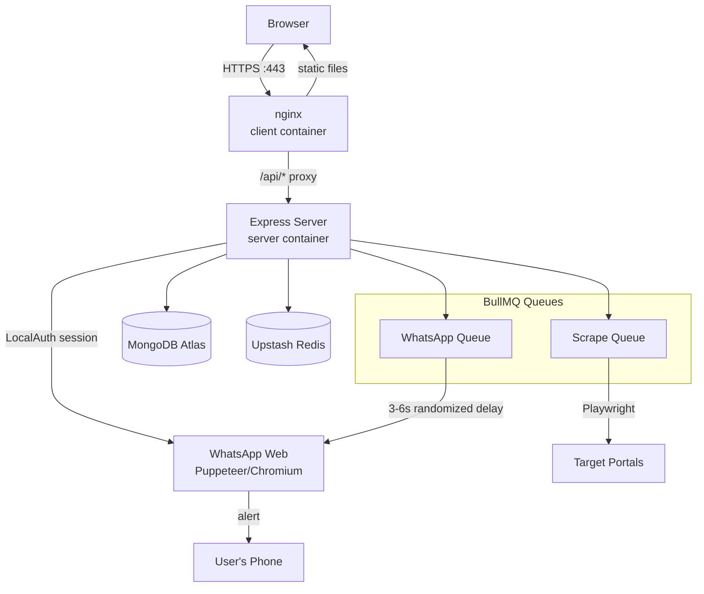
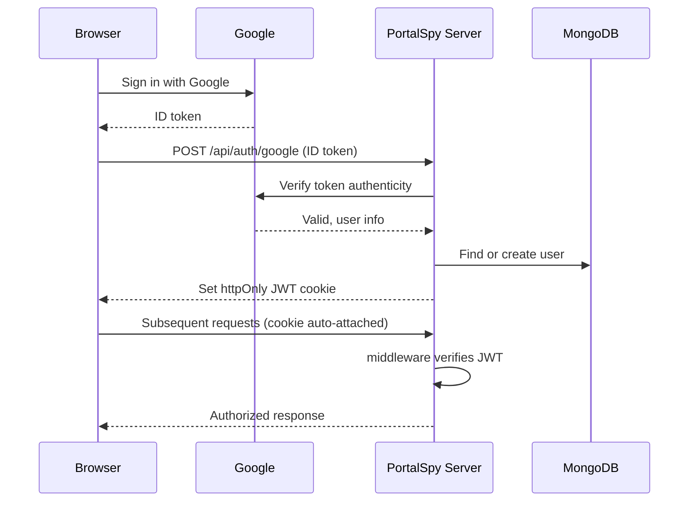

# PortalSpy

**Real-time portal monitoring with automated WhatsApp alerts.**

PortalSpy watches job/data portals for keyword matches and pings you on WhatsApp the moment something relevant shows up — no manual refreshing, no missed openings.

Live: [https://portalspy.duckdns.org](https://portalspy.duckdns.org)

---

## Features

- 🔐 JWT-based auth + Google OAuth 2.0 login
- 🌐 Dynamic scraping engine for portals that render content client-side
- ⚡ Async, queued task processing via BullMQ + Redis (with anti-spam rate limiting on outbound alerts)
- 📲 Automated WhatsApp alerts via `whatsapp-web.js`
- 📊 Dashboard for portal management, filter configuration, stats, and alert history


## Tech Stack

| Layer | Technology |
|---|---|
| Frontend | React, Vite, Tailwind CSS |
| Backend | Node.js, Express |
| Database | MongoDB (Atlas, managed) |
| Queue / Cache | Redis (Upstash, managed) + BullMQ |
| Scraping | Playwright |
| Notifications | whatsapp-web.js (Puppeteer-driven, LocalAuth session) |
| Auth | JWT, Google OAuth 2.0 |
| Infra | AWS EC2, Docker, Docker Compose, nginx, Encrypt |

---

## Architecture

PortalSpy runs as two independently built Docker containers behind a single reverse proxy, backed by two managed cloud services (MongoDB Atlas, Upstash Redis) so the compute layer itself stays stateless and disposable.



**Why this shape:**
- `whatsapp-web.js` needs a real, persistent Chromium session tied to a QR-code login — that rules out serverless/Lambda-style compute, which is why this runs on a single long-lived EC2 instance rather than functions.
- MongoDB and Redis are offloaded to managed services (Atlas, Upstash) instead of self-hosted containers, so the EC2 box only has to carry the app itself — smaller instance, no DB ops burden, no data loss risk if the instance is rebuilt.
- nginx sits in front of Express and never exposes the API port directly to the internet — the `server` container is only reachable inside the Docker network.

## Project Structure

```
PortalSpy/
├── client/                      # React + Vite frontend
│   ├── src/
│   │   ├── components/          # UI components (dashboard, forms, etc.)
│   │   ├── pages/                # Route-level views
│   │   ├── context/              # Auth/session context providers
│   │   └── services/              # Axios API client wrappers
│   ├── index.html
│   ├── vite.config.js
│   └── package.json
│
├── server/                      # Express backend
│   ├── config/                  # DB connection, Redis options
│   ├── controllers/             # Route handler logic
│   ├── middleware/              # JWT auth guard, error handling
│   ├── models/                  # Mongoose schemas (User, Portal, Alert, etc.)
│   ├── queues/                  # BullMQ queue + worker definitions
│   ├── routes/                  # Express route definitions (mounted at /api)
│   ├── scripts/                 # One-off scripts (e.g. seedDemoData.js)
│   ├── services/                # Scraper (Playwright) + WhatsApp (whatsapp-web.js)
│   ├── server.js                # App entry point — boots DB, queues, WhatsApp client
│   └── package.json
│
├── server.Dockerfile            # Node + Chromium image for the backend
├── client.Dockerfile            # Multi-stage Vite build → nginx image
├── nginx.conf                   # Reverse proxy + HTTPS (production)
├── nginx-temp.conf              # HTTP-only config used during cert issuance
├── docker-compose.yml           # Orchestrates server, client/nginx, certbot
└── README.md
```

**Backend flow through the folders:** a request hits `routes/` → validated/authenticated by `middleware/` → handled by `controllers/` → reads/writes via `models/` → long-running work (scraping, WhatsApp sends) is handed off to `queues/`, which call into `services/` asynchronously rather than blocking the request.

## Data Flow

**1. Portal registration → scheduled scraping**
A user adds a portal + keyword filters via the dashboard. This creates a repeating BullMQ job on the **Scrape Queue**, scheduled at the interval the user configured (e.g. every N hours).

**2. Scrape execution**
When a job fires, a worker (concurrency: 3) pulls the portal from MongoDB, confirms it's still `ACTIVE`, and runs `runPortalScrape()` — Playwright loads the portal (headless Chromium), extracts listings, and diffs them against previously seen entries.

**3. Match found → alert queued**
A new match is written to MongoDB and a job is pushed onto the **WhatsApp Queue**, rather than sending the message inline — this decouples scraping speed from WhatsApp's rate limits.

**4. Rate-limited dispatch**
The WhatsApp worker (concurrency: 1, deliberately serialized) waits a randomized 3–6 second delay per message before dispatching, to avoid tripping WhatsApp's anti-spam detection, then sends via the authenticated `whatsapp-web.js` client.

**5. Delivery**
The message lands on the user's phone through their own linked WhatsApp Web session — PortalSpy sends *as* the user's own WhatsApp account, not a bot number.

---

## Authentication

PortalSpy supports two ways in: email/password with JWT, and Google OAuth 2.0. Both end in the same place — a signed JWT stored in an `httpOnly` cookie, checked by `middleware/` on every protected route.

### Setup

**Google OAuth Client** (Google Cloud Console → APIs & Services → Credentials → OAuth 2.0 Client ID → Web application):
- **Authorized JavaScript origins**: your frontend's exact origin, e.g. `https://portalspy.duckdns.org` (Google rejects bare IP addresses here — it must end in a public TLD)
- **Authorized redirect URIs**: same origin
- Copy the generated Client ID into both:
  - `server/.env` → `GOOGLE_CLIENT_ID`
  - `client/.env` → `VITE_GOOGLE_CLIENT_ID` (this one gets baked into the frontend bundle at build time, since Vite inlines `VITE_*` vars at compile time)

**JWT:**
- `server/.env` → `JWT_SECRET` — a long random string (e.g. `openssl rand -base64 32`), used to sign and verify tokens. Never commit this.

### Flow

**Email/password:**
1. Client `POST /api/auth/register` or `/api/auth/login` with credentials
2. Server verifies the password against the `bcryptjs` hash stored in MongoDB
3. Server signs a JWT (payload: user ID, expiry) with `JWT_SECRET`, sets it as an `httpOnly` cookie via `cookie-parser`
4. Every subsequent request automatically carries that cookie; `middleware/` verifies the JWT signature and expiry before allowing the request through to a controller

**Google OAuth:**
1. Client uses `@react-oauth/google` to trigger Google's sign-in popup — this never touches PortalSpy's own server directly, it's a direct browser ↔ Google exchange
2. Google returns an ID token to the client
3. Client sends that ID token to the server (`POST /api/auth/google`)
4. Server verifies the token's authenticity with Google's `google-auth-library` (confirms it was really issued by Google, for this app's Client ID, and hasn't expired)
5. Server looks up or creates a matching user record in MongoDB, then issues its own JWT exactly as in the email/password flow — from this point on, Google is out of the picture and the session behaves identically either way



---

## Deployment (AWS EC2)

This section documents the actual path taken to get PortalSpy from a local repo to a live, HTTPS-secured deployment — useful both as a runbook and as a reference for anyone deploying a similar stack.

### 1. Why EC2, not serverless

`whatsapp-web.js` requires a persistent Chromium process with session state (`LocalAuth`) written to disk, and that state has to survive across requests and restarts. Lambda/Fargate-without-a-volume can't hold that state reliably, so the backend needed a traditional, always-on compute instance — a single `t3.small` EC2 instance running Ubuntu 24.04.

### 2. Instance setup

- Launched Ubuntu 24.04 LTS, `t3.small`, 20 GiB gp3 root volume (Chromium + `node_modules` + WhatsApp session data need more than the 8 GiB default)
- Security group: SSH (22) restricted, HTTP (80) and HTTPS (443) open to the internet
- Allocated and associated an **Elastic IP** immediately after launch — without it, the public IP changes on every stop/start, which would silently break DNS, OAuth config, and the WhatsApp session's expectations

### 3. Managed data layer

Rather than running MongoDB and Redis as containers on the same small instance, both were offloaded to free managed tiers:
- **MongoDB Atlas** (M0 free cluster) — network access restricted to the EC2 instance's Elastic IP
- **Upstash Redis** — connected over `rediss://` with password auth, used directly by BullMQ

This kept the instance itself stateless from a data perspective — it can be rebuilt at any time without any data loss risk, since nothing important lives on its disk except the WhatsApp session.

### 4. Dockerizing the app

Two separate images, one per concern:

**`server.Dockerfile`** — Node 20 (bookworm-slim) + Chromium and its full set of system libraries (`libnss3`, `libgbm1`, `libatk-bridge2.0-0`, etc. — Chromium won't launch headless in a minimal container without these) installed via `apt`. `whatsapp-web.js`'s Puppeteer layer auto-detects the installed Chromium at `/usr/bin/chromium` at runtime, so no code changes were needed — the app's existing fallback path-detection logic just worked once the binary existed at a standard location. `dumb-init` is used as PID 1 so signals and the Chromium child process are reaped correctly.

**`client.Dockerfile`** — multi-stage build: Node builds the Vite production bundle (with `VITE_GOOGLE_CLIENT_ID` and `VITE_API_URL` baked in at build time via Docker build args, since Vite inlines env vars at compile time, not runtime), then the static output is copied into a minimal `nginx:alpine` image for serving.

**`docker-compose.yml`** ties them together:
- `server` — no ports published to the host, only `expose`d internally, so it's unreachable from outside Docker's network
- `client` (nginx) — the only container bound to the host's `80`/`443`, and it reverse-proxies any `/api/*` request to `http://server:5001/api` over Docker's internal network by service name
- A named volume (`wwebjs_auth`) is mounted into the server container at `/app/.wwebjs_auth`, so the WhatsApp `LocalAuth` session survives container rebuilds — without it, every `docker compose up --build` would force a fresh QR-code scan

```
Internet → :443/:80 → [nginx/client container] → /api/* → [server container:5001] → Atlas / Upstash
                            ↓
                     static React build
```

### 5. From IP address to a real domain (DuckDNS)

Google OAuth's client configuration rejects bare IP addresses in Authorized JavaScript Origins outright (*"Must end with a public top-level domain"*), which meant `http://<elastic-ip>` was a dead end for login. The fix: **DuckDNS**, a free dynamic DNS service, mapping `portalspy.duckdns.org` → the EC2 Elastic IP. DuckDNS's only job here is DNS resolution — it doesn't touch anything else about how the app runs. Once the domain resolved correctly, the Google OAuth client, and the server's `CLIENT_URL` (used for CORS), were both updated to use the new domain instead of the raw IP.

### 6. HTTP → HTTPS (Let's Encrypt / Certbot)

With a real domain in place, HTTPS became straightforward via Certbot's webroot challenge:

1. A temporary HTTP-only nginx config served `/.well-known/acme-challenge/` from a shared volume
2. `docker compose run certbot certonly --webroot ...` requested a certificate — Let's Encrypt's servers independently verified domain ownership by fetching a token from that path over the public internet, confirming the requester actually controlled the server behind the DNS record
3. Once issued, nginx was reconfigured with a proper `server { listen 443 ssl; }` block, using the issued `fullchain.pem`/`privkey.pem`, plus a `301` redirect from port 80 to 443 so HTTP requests always upgrade
4. The Google OAuth client and `CLIENT_URL` were updated once more, from `http://` to `https://`

The certificate is valid for 90 days and auto-renews via Certbot's built-in renewal mechanism.

### 7. Day-to-day operations

```bash
# Deploy a code change
git pull origin main
docker compose up -d --build

# Tail logs
docker compose logs -f server

# Check container health
docker compose ps
```

---

## Local Development

```bash
# Server
cd server
cp .env.example .env   # fill in your own values
npm install
npm run dev

# Client
cd client
cp .env.example .env
npm install
npm run dev
```